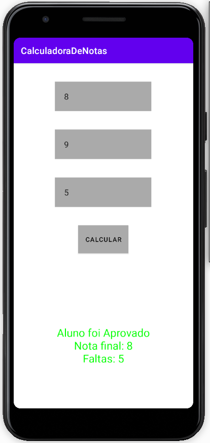
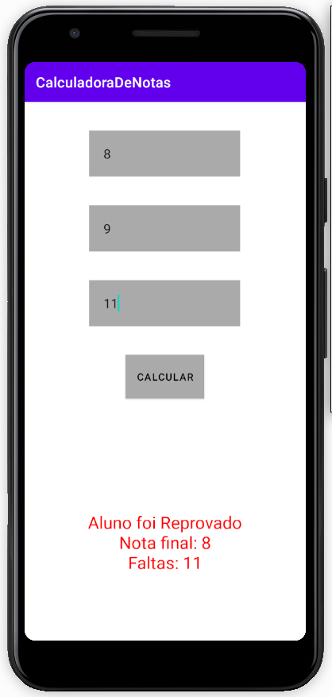

# Calculadora de Notas em Kotlin / Android Studio

## Descrição

O Aplicativo lê duas notas e a quantidade de faltas de um aluno

Caso a média das duas notas seja maior ou igual a 6 e a quantidade de faltas seja menor ou igual a 10, o aluno é aprovado

Caso contrário, o aluno é reprovado

